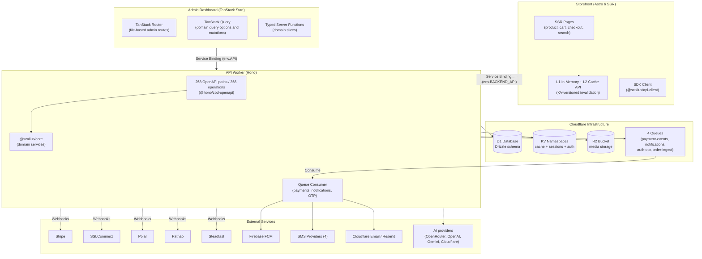
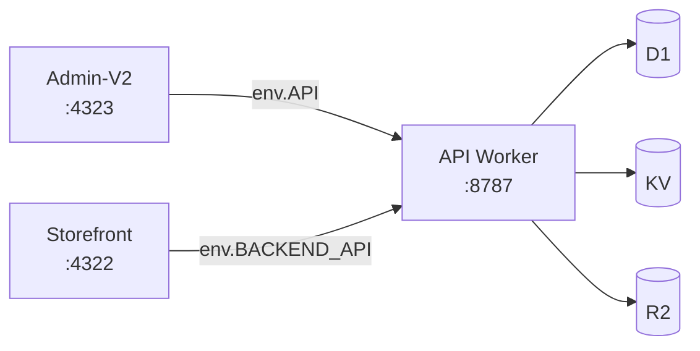
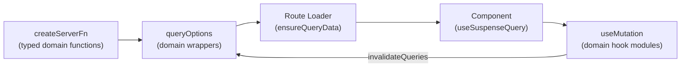

<p align="center">
  <a href="https://scalius.com">
    
  </a>
</p>

<h1 align="center">
  Scalius Commerce Lite
</h1>

<h4 align="center">
  <a href="https://docs.scalius.com">Documentation</a> |
  <a href="https://scalius.com">Website</a>
</h4>

<p align="center">
  Full-stack e-commerce platform — admin dashboard, storefront, and API — deployed as Cloudflare Workers. Turborepo monorepo with TanStack Start, Astro, Hono, and Cloudflare D1.
</p>

<p align="center">
  <a href="https://github.com/rahmatullahboss/scalius-commerce-lite/actions/workflows/ci.yml">
    
  </a>
  <a href="https://github.com/rahmatullahboss/scalius-commerce-lite/actions/workflows/security.yml">
    
  </a>
  <a href="https://github.com/rahmatullahboss/scalius-commerce-lite/blob/main/LICENSE">
    
  </a>
  <a href="https://github.com/rahmatullahboss/scalius-commerce-lite/issues">
    
  </a>
  <a href="https://github.com/rahmatullahboss/scalius-commerce-lite/blob/main/SECURITY.md">
    
  </a>
</p>

<p align="center">
  <a href="https://scalius.com/x">
    
  </a>
  <a href="https://scalius.com/discord">
    
  </a>
  <a href="https://scalius.com/facebook">
    
  </a>
</p>

## Overview

Scalius Commerce Lite is a **Turborepo monorepo** containing three Cloudflare Workers and five shared packages. All workers communicate via **Cloudflare Service Bindings** (zero-latency RPC in production).

```text
apps/
  admin-v2/       # @scalius/admin-v2 — TanStack Start admin dashboard (Cloudflare Worker)
  api/            # @scalius/api — Hono standalone API + queue consumer (Cloudflare Worker)
  storefront/     # @scalius/storefront — Astro 6 SSR customer store (Cloudflare Worker)
packages/
  api-client/     # @scalius/api-client — Generated SDK from OpenAPI spec
  core/           # @scalius/core — domain modules, auth, integrations, FTS5 search
  database/       # @scalius/database — Drizzle schema and migrations
  shared/         # @scalius/shared — shared utilities and rendering helpers
  tsconfig/       # @scalius/tsconfig — Shared TypeScript configs (base, astro, worker)
scripts/          # Dev setup, deploy pipeline, dev server wrapper
```

### Tech Stack

| Layer | Technology |
|-------|-----------|
| Monorepo | Turborepo + pnpm workspaces |
| Admin Dashboard | TanStack Start + TanStack Router + TanStack Query + React 19 |
| Storefront | Astro 6 SSR + React 19 |
| API | Hono + @hono/zod-openapi (auto-generated OpenAPI/Swagger) |
| Database | Cloudflare D1 (SQLite) + Drizzle ORM + FTS5 full-text search |
| UI | Tailwind CSS v4 + shadcn/ui + Radix primitives |
| Auth | Better Auth (email/password + optional 2FA with TOTP/email OTP) |
| Caching | Cloudflare KV + in-memory L1 + Cache API L2 (storefront) |
| Storage | Cloudflare R2 for media + Cloudflare Image Resizing |
| Queues | Cloudflare Queues (payments, notifications, OTP, order ingestion) |
| Payments | Stripe, SSLCommerz, Polar, COD |
| Delivery | Pathao, Steadfast (webhook-driven tracking) |
| Notifications | Email (Cloudflare Email default, Resend fallback), SMS (4 providers), Firebase Cloud Messaging |
| AI | AI SDK providers for widget/content generation (OpenRouter, OpenAI, Gemini, Cloudflare Workers AI) |
| CI/CD | GitHub Actions (lint → typecheck → build → test) |
| Deploy | Cloudflare Workers via Wrangler |

---

## Architecture



### Service Binding Topology



In production, service bindings are zero-latency RPC calls (no HTTP overhead). In local development, admin falls back to the Vite proxy/HTTP API at `localhost:8787`, and storefront intentionally skips local service binding because separately started Miniflare processes cannot reliably share the Fetcher.

---

## Features

### Commerce
- Products with variants (size, color, SKU, barcode), images, rich content, attributes
- Categories, collections (manual & dynamic), product attributes
- Inventory management with stock versioning (CAS), reservations, low-stock alerts
- FTS5 full-text search with Bengali tokenizer support

### Sales
- Orders with 11-state machine (pending → processing → confirmed → shipped → delivered → completed)
- 3 payment gateways (Stripe, SSLCommerz, Polar) + Cash on Delivery
- Atomic payment processing via `db.batch()` with idempotency indexes
- Discounts (percentage, fixed, free shipping) with eligibility rules
- Abandoned checkout tracking and recovery
- Customer management with order history

### Storefront Content
- Header/footer builders (JSON config)
- Navigation builder with drag-and-drop hierarchy
- CMS pages with Tiptap rich text editor
- Hero slider management (desktop + mobile variants)
- Homepage widgets with AI-powered generation through dashboard-configured AI providers

### Operations
- 2 delivery providers (Pathao, Steadfast) with webhook-driven tracking
- Shipping methods (flat-rate, weight-based, zone-based)
- Fraud checker (manual merchant tool per order)
- Cache management dashboard (KV stats, selective purge)
- Invoice generation and PDF download

### Notifications
- 9 notification types (order placed → refunded)
- 3 channels: Email (Cloudflare Email default, Resend fallback), SMS (4 providers), FCM push
- Per-status channel independence (configurable per event type)
- Queue-driven async delivery

### Security
- Better Auth with optional 2FA (TOTP authenticator + email OTP + backup codes)
- RBAC with 80+ permissions across 14 categories
- Rate limiting per endpoint
- AES-GCM credential encryption for provider secrets
- Webhook signature verification (per-provider)
- Compare-and-swap (CAS) concurrency control on order/inventory updates

---

## Admin Dashboard (`apps/admin-v2/`)

The admin dashboard is built with **TanStack Start** — a full-stack React framework on Cloudflare Workers.

### Data Flow



- **Server Functions**: typed functions live under domain slices in `src/lib/api-functions/`
- **Query Options**: React Query wrappers live in narrow domain modules with 7 staleTime tiers (10s -> 1hr); do not recreate the removed broad query barrel
- **Mutations** (`src/lib/api-mutations/<domain>.ts`): domain hook modules with cache invalidation and toast notifications; `api.mutations.ts` is only a compatibility re-export barrel
- **Stale-While-Revalidate**: Detail queries use `staleTime: 0` + loader `staleTime: Infinity` for instant navigation
- **Idle Tab Behavior**: The global QueryClient keeps warm data for 30 minutes but disables focus-return refetch by default. Realtime admin screens opt in per query to avoid long-idle tabs stampeding the API on focus.
- **Scroll Restoration**: The admin shell registers its nested `#admin-main-scroll` container with TanStack Router scroll restoration and uses `useAdminNestedScrollRestoration()` to reset normal client navigation to top while restoring nested scroll on browser Back/Forward. Avoid ad hoc layout-level route-change `scrollTo()` effects.

### Pages (60+)

| Section | Pages |
|---------|-------|
| Dashboard | Stats, recent orders, activity |
| Products | List, create, edit, view, variants, images, SEO |
| Orders | List, create, edit, view, shipments, payments, invoices |
| Categories | List, create, edit |
| Collections | List, create, edit, trash, drag-and-drop reorder |
| Customers | List, create, edit, history |
| Discounts | List, create (3 types), edit |
| Pages (CMS) | List, create, edit with Tiptap editor |
| Widgets | List, edit with AI generation, history/restore |
| Attributes | List, inline edit, value management |
| Inventory | Stock levels, adjustments, alerts |
| Media | File browser with folders, upload, move, delete |
| Analytics | Tracking script management |
| Settings | 12+ tabs (general, checkout, payments, delivery, notifications, auth, etc.) |

### Key Libraries

TanStack Start, TanStack Router, TanStack Query, TanStack Table, React 19, shadcn/ui, Tailwind v4, React Hook Form, Zod, Tiptap, dnd-kit, Recharts, Sonner, Firebase

---

## Storefront (`apps/storefront/`)

The storefront is an **Astro 6 SSR** application with React 19 islands for interactivity.

### Pages

| Page | Description |
|------|-------------|
| Homepage | Hero slider, widgets, collections |
| Product (`/products/[slug]`) | Gallery, variants, JSON-LD, OG meta |
| Category (`/categories/[slug]`) | Product grid with attribute filters |
| Search (`/search`) | FTS5-powered with price/attribute filters |
| Cart | Line items, discount codes, shipping calculator |
| Checkout | Multi-gateway payment selection |
| Order Success | Confirmation with tracking link |
| CMS Pages (`/[slug]`) | Dynamic content pages |

### Caching (Two-Tier)

- **L1**: In-memory Map (max 1000 entries, LRU eviction, per-isolate)
- **L2**: Cloudflare Cache API with KV version control (survives cold starts)
- **Invalidation**: `POST /api/purge-cache` bumps KV or exact-path generations; affected edge caches become stale. `GET /api/purge-cache` is intentionally non-mutating and returns `405 Allow: POST`. Catalog and CMS writes send bounded exact `htmlPaths` so affected product/category/search/CMS pages are rewarmed immediately; checkout-affecting admin writes, including delivery providers, invalidate the checkout cache group and purge matching storefront prefixes.
- **Cache busting**: `BUILD_ID` in cache key ensures new deploys never serve stale HTML

### SEO

- JSON-LD schemas (Product, BreadcrumbList)
- Open Graph + Twitter Card meta tags
- Canonical URLs, robots.txt, XML sitemaps
- Cloudflare Image Resizing for responsive images

---

## API Worker (`apps/api/`)

Standalone **Hono** app with auto-generated OpenAPI spec and interactive Swagger UI.

### API Surface

The generated OpenAPI spec and `packages/api-client/openapi.json` are the source of truth for exact path/operation counts.

| Namespace | Auth | Purpose |
|-----------|------|---------|
| `/api/v1/admin/**` | Session/JWT + RBAC | Admin CRUD operations |
| `/api/v1/products`, `/categories`, etc. | None | Public storefront data |
| `/api/v1/orders/**` | Customer/session or receipt-token scoped | Customer order creation, status, and receipts |
| `/api/v1/payment/**` | Receipt-token scoped | Payment session creation |
| `/api/v1/webhooks/**` | Provider signature/token validation | Gateway and delivery callbacks |
| `/api/v1/health`, `/docs` | None | System endpoints |

### Queue Processing

| Queue | Messages | Batch Size |
|-------|----------|------------|
| `payment-events` | `payment.stripe.*`, `payment.sslcommerz.*`, `payment.polar.*` | 10 |
| `order-notifications` | `order.notification` (9 types) | 20 |
| `auth-otp` | `auth.send_otp` (email, SMS, WhatsApp) | 10 |
| `order-ingest` | `order.ingest` (batch creation) | 100 |

### Response Contract

All success responses: `{ "success": true, "data": T }`
All error responses: `{ "success": false, "error": { "code": "...", "message": "..." } }`

---

## Database (`packages/database/`)

Drizzle schema and SQL migrations for Cloudflare D1 (SQLite). The schema declarations and migration journal are the source of truth; avoid copying volatile table or migration counts into docs.

| Domain | Key Tables |
|--------|------------|
| Auth | user, session, account, verification, twoFactor |
| RBAC | permissions, roles, rolePermissions, userRoles, userPermissions |
| Products | products, productVariants, productImages, categories, collections, productAttributes, media, mediaFolders |
| Orders | orders, orderItems, orderPayments, paymentPlans, codTracking, webhookEvents, abandonedCheckouts |
| Customers | customers, customerHistory |
| Inventory | inventoryMovements, productLowStockAlerts |
| Delivery | deliveryLocations, deliveryProviders, deliveryShipments |
| Marketing | discounts, discountProducts, discountCollections, discountUsage, metaConversionsSettings, metaConversionsLogs |
| Content | pages, widgets, widgetPlacements, widgetHistory, heroSections, heroSliders, pageTemplates |
| System | settings, siteSettings, analytics, adminFcmTokens, shippingMethods, checkoutLanguages |

FTS5 full-text search with Bengali tokenizer is enabled by migration `0031`.

---

## Scripts

```bash
# Development
pnpm dev                # Start API :8787 + admin-v2 :4323 + storefront :4322
pnpm dev:all            # Alias for pnpm dev
pnpm dev:api            # Start API :8787 through the local wrapper
pnpm dev:admin          # Start API :8787 + admin-v2 :4323
pnpm dev:storefront     # Start storefront :4322 + API :8787

# Build & Deploy
pnpm build              # Build all workspaces via Turbo
pnpm run deploy             # Typecheck → build → migrate → deploy all workers
pnpm run deploy:api         # Typecheck → build API → migrate remote D1 → deploy API
pnpm run deploy:admin       # Typecheck → build admin-v2 → deploy admin-v2
pnpm run deploy:storefront  # Typecheck → build storefront → deploy storefront

# Database
pnpm db:generate        # Generate Drizzle migrations from schema changes
pnpm db:migrate:local   # Apply pending migrations locally
pnpm db:studio          # Open Drizzle Studio DB browser

# Testing & Quality
pnpm lint               # ESLint all seven code workspaces through Turbo
pnpm test               # Run all tests via Vitest
pnpm test:coverage      # Run all tests and enforce repository-wide coverage floors
pnpm test:e2e           # Run the full local marketplace Playwright suite
pnpm typecheck          # TypeScript type checking (tsc, NOT esbuild)
pnpm generate:sdk       # Regenerate API client from OpenAPI spec

# Setup & Maintenance
pnpm dev:setup          # Install deps, create env, migrate, create local admin
pnpm dev:reset          # Wipe local state, migrate, recreate local admin
pnpm dev:admin:create   # Create local admin if none exists
pnpm dev:admin:reset    # Reset local auth/admin credentials only
pnpm dev:admin:status   # Check whether a local admin exists
pnpm dev:doctor         # Diagnose local env, state, ports, and service readiness
pnpm dev:doctor:api     # Require API :8787 to be running
pnpm dev:doctor:admin   # Require API :8787 + admin-v2 :4323 to be running
pnpm dev:doctor:storefront  # Require API :8787 + storefront :4322 to be running
pnpm dev:doctor:all     # Require API, admin-v2, and storefront to be running
```

---

## Local Development

### 1) First-time setup

```bash
nvm use
pnpm dev:doctor
pnpm dev:setup
```

Use the current Node 22 LTS line from `.nvmrc` (Node 22.18+ is required by the current toolchain); `pnpm dev:doctor` warns when your active Node version differs. `pnpm dev:doctor` is non-mutating and tells you what local setup is missing before you start changing state. `pnpm dev:setup` generates secrets, creates `.dev.vars` files, applies D1 migrations, starts a temporary API worker, and creates a default local admin if none exists. If some local env files already exist, setup reuses the existing shared secrets for any missing files and fails loudly if API/admin/storefront secrets disagree.

Use `pnpm dev:setup --env-only` when `dev:doctor` reports missing, incomplete, or non-local env URL values. It appends missing/blank keys in `.dev.vars` and `.env.development` without installing dependencies, applying migrations, or creating an admin. Use `pnpm dev:setup --force --env-only` only when local env files must be regenerated or shared secrets are out of sync; it still avoids database/admin changes because of `--env-only`.

Default local admin:

```text
Email:    admin@example.com
Password: ScaliusLocal123!
```

Override the local admin with flags or environment variables:

```bash
pnpm dev:setup --admin-email owner@example.test --admin-password 'Use-12+-chars' --admin-name 'Owner'

LOCAL_ADMIN_EMAIL=owner@example.test \
LOCAL_ADMIN_PASSWORD='Use-12+-chars' \
LOCAL_ADMIN_NAME='Owner' \
pnpm dev:setup
```

### 2) Start development servers

```bash
pnpm dev              # API + admin-v2 + storefront
pnpm dev:api          # API only
pnpm dev:admin        # API + admin-v2 only
pnpm dev:storefront   # API + storefront only
pnpm dev:doctor:all   # Verify full stack after pnpm dev
```

The dev wrapper (`scripts/dev.sh`) applies pending local D1 migrations before starting API, kills stale processes on the Scalius dev ports, waits for API `/api/v1/setup` before starting admin/storefront, staggers admin/storefront startup to prevent Vite inspector port conflicts, and cleans up on Ctrl+C. Set `SCALIUS_SKIP_DEV_MIGRATIONS=1` when you intentionally want to skip the migration check. It no longer kills every `workerd` process by default; set `SCALIUS_DEV_KILL_ALL_WORKERD=1` only if you need the older aggressive cleanup.

Use the matching doctor command after startup: `pnpm dev:doctor:api` after `pnpm dev:api`, `pnpm dev:doctor:admin` after `pnpm dev:admin`, `pnpm dev:doctor:storefront` after `pnpm dev:storefront`, and `pnpm dev:doctor:all` after the full `pnpm dev` stack. Plain `pnpm dev:doctor` remains a non-mutating broad overview and will warn when a service is intentionally stopped.

API local dev uses `apps/api/wrangler.local.jsonc`, which intentionally omits the remote Workers AI binding. Normal local admin/storefront/API work should not require Cloudflare remote proxy access. Production build/deploy still use `apps/api/wrangler.jsonc`.

Admin production calls the API through the `env.API` service binding. Local admin dev uses HTTP fallback to `PUBLIC_API_BASE_URL` when that URL points at localhost, even though Wrangler still exposes the production binding shape. `pnpm dev:doctor` validates that local API/admin/storefront URL values point at the expected localhost ports.

For disposable local testing, point all Workers at another state directory:

```bash
pnpm dev:reset --state /tmp/scalius-commerce-state
SCALIUS_WRANGLER_STATE=/tmp/scalius-commerce-state pnpm dev:admin
```

Relative `--state` paths resolve from the repo root; absolute paths are easiest to reason about across Wrangler commands.

### 3) Sign in

Visit `http://localhost:4323/admin` and sign in with the local admin credentials from setup. If you ran setup with `--skip-admin`, the browser still supports the first-admin setup flow at `/auth/setup`.

### 4) Reset local credentials or state

Reset only local admin credentials and sessions:

```bash
pnpm dev:admin:reset
```

Reset everything local, including D1/KV/R2/Cache state, then recreate the default admin:

```bash
pnpm dev:reset
```

Both commands accept the same admin override flags:

```bash
pnpm dev:reset --admin-email owner@example.test --admin-password 'Use-12+-chars'
```

### 5) Local URLs

| URL | Service |
|-----|---------|
| `http://localhost:4323/admin` | Admin Dashboard (TanStack Start) |
| `http://localhost:4322` | Storefront |
| `http://localhost:8787/api/v1/docs` | Swagger UI (interactive API docs) |
| `http://localhost:8787/api/v1/openapi.json` | OpenAPI 3.0 spec |
| `http://localhost:8787/api/v1/health` | Health check |

---

## Environment Variables

`pnpm dev:setup` generates everything automatically. Each worker has:

- **`wrangler.jsonc`** — Cloudflare bindings and non-secret vars
- **`.dev.vars`** — Runtime secrets (gitignored)

### Required Secrets

| Variable | Shared By | Purpose |
|----------|-----------|---------|
| `BETTER_AUTH_SECRET` | API + Admin-v2 | Session signing |
| `JWT_SECRET` | API + Admin-v2 + Storefront | JWT signing |
| `API_TOKEN` | All workers | Internal machine-to-machine auth |
| `PURGE_TOKEN` | API + Storefront | Cache purge authentication |
| `CREDENTIAL_ENCRYPTION_KEY` | API + Admin-v2 | Provider credential encryption |

### Dashboard-Configured Integrations

| Integration | Settings Location |
|-------------|-------------------|
| Email (Cloudflare Email / Resend) | Settings → Email |
| Firebase (FCM) | Settings → Notifications |
| Stripe / SSLCommerz / Polar | Settings → Checkout → Payment Gateways |
| Pathao / Steadfast | Settings → Delivery Providers |
| SMS Providers | Settings → Notifications / SMS providers |
| AI providers | Settings -> Widget AI / widget editor settings |

---

## CI/CD

GitHub Actions validates every pull request and every push to `main` with:

- lint, TypeScript checks, project-isolation checks, migration metadata, and diff integrity;
- all 1,956 Vitest tests plus repository-wide V8 coverage reports and enforced baseline floors;
- production builds for API, Admin, and Storefront with dist secret checks;
- the complete local marketplace Playwright journey, including onboarding, catalog moderation, checkout, fulfillment, COD, settlement, payout, and refund;
- CodeQL, dependency review, and production dependency auditing.

Coverage HTML, LCOV, JSON, build bundles, Playwright traces, screenshots, videos, and service logs are retained as workflow artifacts. Tags matching `v*` create a GitHub Release containing verified build bundles, coverage, migrations, and SHA-256 checksums.

## Deployment

The `Deploy Cloudflare` workflow is manual and defaults to dry-run mode. A real remote deployment must be dispatched from `main`, use the protected `production` environment, include the `DEPLOY` confirmation, provide Cloudflare environment secrets, pass the complete verification pipeline, satisfy the repository deploy guard, and use non-placeholder Wrangler resources.

Required production environment secrets:

- `CLOUDFLARE_API_TOKEN`
- `CLOUDFLARE_ACCOUNT_ID`

Optional environment variable:

- `PRODUCTION_STOREFRONT_URL` — shown on the GitHub deployment record.

Local deployment commands remain available:

```bash
pnpm run deploy
pnpm run deploy:api
pnpm run deploy:admin
pnpm run deploy:storefront
```

The full local pipeline is `typecheck → build → migrate remote D1 → deploy all workers`. Targeted shortcuts use the same fail-closed deploy guard. Remote mutation stays blocked while Wrangler uses local placeholder resources.

### Production Domains

| Domain | Worker | Purpose |
|--------|--------|---------|
| `dashboard.scalius.com` | scalius-admin-v2 | Admin Dashboard |
| `api.scalius.com` | scalius-api | REST API |
| `storefront.scalius.com` | scalius-storefront | Customer Store |
| `cloud.scalius.com` | R2 Bucket | Media CDN + Image Resizing |

### Cloudflare Bindings (Production, Per Worker)

Not every worker has every binding. Wrangler configs are the source of truth for exact bindings per worker.

| Binding | Type | Purpose |
|---------|------|---------|
| `DB` | D1 | Shared SQLite database |
| `CACHE` | KV | General caching |
| `SESSION` | KV | Better Auth sessions |
| `SHARED_AUTH_CACHE` | KV | Cross-worker auth token cache |
| `BUCKET` | R2 | Media file storage |
| `API` / `BACKEND_API` | Service Binding | Admin/Storefront → API |

---

## Troubleshooting

| Problem | Solution |
|---------|----------|
| Port conflicts on startup | `lsof -tiTCP:8787 -iTCP:4322 -iTCP:4323 -iTCP:9229 -iTCP:9230 -iTCP:9231 -iTCP:9232 -iTCP:9233 -sTCP:LISTEN \| xargs kill -9` |
| Forgot local admin credentials | Run `pnpm dev:admin:reset` |
| Auth sign-in loops | Run `pnpm dev:admin:reset`; use `pnpm dev:setup --env-only` for missing local env keys, or `pnpm dev:setup --force --env-only` only when shared local secrets are out of sync |
| D1 errors in dev | Run `pnpm dev:reset` for a clean database |
| "Using default JWT secret" | Set `JWT_SECRET` in `.dev.vars` |
| Stale OpenAPI types | Run `pnpm generate:sdk` with API running |

---

## License

[AGPL v3](LICENSE)
