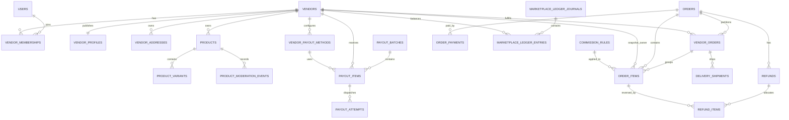

# Multi-Vendor Target Architecture

**Date:** 2026-07-13  
**Architecture style:** modular monolith, seller-scoped bounded contexts, D1-safe transactional commands, durable domain outbox, append-only marketplace subledger  
**Product model:** one seller owns one product; shared-catalog/multiple-offer modeling is intentionally deferred

## 1. Architecture decision

Scalius Commerce remains one deployable commerce platform and one canonical database. The multi-vendor capability is implemented as bounded contexts inside the existing monorepo, not as a second application with synchronized copies of products, orders, customers, payments, or inventory.

The target architecture separates three concerns that the current prototype mixes:

1. **Customer commerce:** customer-facing order, checkout, payment, discount, and refund state.
2. **Seller operations:** seller identity, catalog ownership, fulfillment groups, shipments, and seller users.
3. **Marketplace accounting:** commission policy, financial allocations, immutable ledger journals, settlement eligibility, and payouts.

`orders` remains the customer purchase aggregate. `vendor_orders` becomes an operational seller fulfillment partition. The marketplace ledger becomes the only accounting source of truth for seller balances.

## 2. Design principles

### 2.1 One business fact, one authority

- Seller access: vendor membership.
- Product ownership: `products.vendor_id` for current catalog state.
- Historical seller ownership: immutable `order_items.vendor_id` and seller snapshot fields.
- Customer payment evidence: succeeded `order_payments`.
- Applied commission: immutable order-item financial allocation.
- Seller balance: posted marketplace ledger entries.
- Payout state: payout batch/item/attempt workflow.
- Public product eligibility: one centralized predicate.

Read models may duplicate totals for performance, but every duplicated value must identify its source and be rebuildable.

### 2.2 Seller identity is never inferred for historical records

A product’s current seller may change only before the product has commercial activity. Once an item is ordered, its seller ID, seller display name, product name, SKU, unit price, currency, and applied commercial policy are immutable snapshots.

### 2.3 Financial records are append-only

Marketplace journal and entry rows are not updated or deleted. Corrections are new reversing or adjustment journals. Payout state rows may transition, but completed financial evidence is immutable.

### 2.4 D1-aware consistency

Use D1 `batch()` for bounded, deterministic mutations. Use a durable outbox for external side effects and for workflows whose complete posting may exceed a safe statement batch. Every consumer is idempotent.

### 2.5 Seller scope is a domain requirement

A seller-scoped command cannot be invoked without an actor context and verified capability. Route-level checks are defense in depth, not the primary authorization boundary.

### 2.6 Compatibility before cleanup

Existing single-store data is assigned to a system-created platform vendor. New canonical columns/tables run in parallel with legacy REAL fields until backfill and reconciliation prove equivalence.

## 3. Bounded contexts and ownership

| Context | Owns | Does not own |
|---|---|---|
| Vendor Identity | vendors, profiles, addresses, memberships, invitations, verification history | Product moderation, order fulfillment, seller balance |
| Marketplace Catalog | product seller ownership, seller submission, moderation events, public eligibility | Inventory quantities, payments |
| Customer Orders | orders, order items, customer totals, checkout idempotency | Seller payable balance |
| Seller Fulfillment | vendor orders, item assignment, seller acceptance, shipment claims | Payment capture, commission revenue |
| Inventory | SKU availability, reservation/deduction/release movements | Seller payout |
| Payments | order payment attempts, captures, refunds with provider | Seller ledger projection |
| Marketplace Accounting | commission rules, item allocation, journals, entries, balance projection | Provider payment credentials |
| Payouts | payout methods, batches, items, attempts | Recalculation of historical commission |
| Domain Events | transactional outbox and consumer leases | Business state authority |

Each context receives one named code owner and one schema owner. Cross-context writes occur through commands or durable events, never direct table imports from route handlers.

## 4. Canonical data model

### 4.1 Vendor identity

#### `vendors` — keep and transform

Required fields:

- `id`
- `slug`
- `display_name`
- `legal_name`
- `status`
- `default_currency`
- `settlement_hold_days`
- `created_at`, `updated_at`, `deleted_at`

Rules:

- Remove `owner_user_id` as a duplicated membership authority.
- `slug` remains globally unique for the shared marketplace storefront.
- Physical deletion is prohibited after products, orders, ledger entries, or payouts exist.
- Suspension affects new sales and seller access but never removes historical financial identity.

#### `vendor_profiles`

One-to-one seller-facing profile: description, logo/banner media IDs, public contact policy, SEO fields, return-policy text, support hours, and publication state. Keep presentation fields out of the financial `vendors` row.

#### `vendor_addresses`

Normalized addresses with `type` values such as `registered`, `pickup`, and `return`. A vendor may have multiple addresses; one active default per type is enforced by service logic and a partial unique index where practical.

#### `vendor_memberships`

Canonical seller-user relationship:

- `vendor_id`
- `user_id`
- `role`
- `status`
- `invited_by`
- `accepted_at`
- `suspended_at`
- timestamps

Unique `(vendor_id, user_id)`. Seller roles map to capabilities in code. Membership does not grant platform administration permissions.

#### `vendor_membership_invites`

Durable invite token hash, intended role, expiry, inviter, consumed timestamp, and revocation state. Do not overload membership rows with unaccepted credentials.

#### `vendor_verification_events`

Append-only history for KYC/trade-license/tax/bank reviews. A current projection may remain on the document row, but every submission, replacement, approval, rejection, and reason is preserved.

### 4.2 Secure payout methods

Replace plaintext payout-account storage with `vendor_payout_methods`:

- `id`, `vendor_id`
- `method_type`
- `encrypted_payload`
- `payload_key_version`
- `display_mask`
- `account_holder_name`
- `status`
- `is_default`
- `verified_by`, `verified_at`
- `version`
- timestamps and soft delete

Only `display_mask` and non-sensitive metadata are returned to normal dashboard clients. Revealing or replacing the encrypted payload is a privileged audited operation. New secrets require the dedicated `CREDENTIAL_ENCRYPTION_KEY` through the repository’s existing credential-encryption utilities.

### 4.3 Seller-owned catalog

For the marketplace MVP, retain the existing product aggregate and make ownership explicit:

- Existing `products.vendor_id` is backfilled to a platform vendor and eventually becomes non-null.
- Existing products are not split into a global catalog plus offers.
- SKU remains globally unique because fulfillment, barcode lookup, and inventory currently depend on that invariant.
- Seller product creation starts in `draft`; submission moves to `submitted`; platform moderation moves to `approved` or `rejected`; suspension is a platform safety action.
- Product ownership transfer is prohibited after the first order item references the product. A later transfer requirement must be modeled as catalog duplication or an explicit migration event.

A shared catalog with multiple competing offers should be introduced only if the business explicitly requires the same catalog product to be sold by multiple vendors. Prematurely adding `catalog_products`, `offers`, and offer-level inventory would increase migration and UI complexity without serving the current seller-owned-product model.

#### `product_moderation_events`

Append-only events:

- `product_id`, `vendor_id`
- `from_status`, `to_status`
- `reason_code`, `reason_text`
- `actor_user_id`, `actor_type`
- timestamp

The product row keeps current status as a projection. State transitions are performed through one moderation service.

### 4.4 Public sellable predicate

Every public catalog and checkout-validation path uses the equivalent of:

```text
product.deleted_at IS NULL
AND product.is_active = true
AND product.approval_status = 'approved'
AND vendor.deleted_at IS NULL
AND vendor.status = 'approved'
```

This predicate must be centralized in the core catalog module and covered by tests for lists, details, search, related products, category pages, collections, widgets, sitemap generation, and checkout item validation.

### 4.5 Customer order and immutable seller allocation

Keep `orders` as the customer-level order. Add canonical minor-unit projections during migration:

- `currency`
- `item_subtotal_minor`
- `discount_minor`
- `shipping_minor`
- `tax_minor`
- `rounding_adjustment_minor`
- `total_minor`
- existing REAL fields retained temporarily for compatibility

Transform `order_items` into the item-level commercial snapshot:

- `vendor_id` — non-null immutable seller snapshot
- `vendor_order_id` — seller fulfillment group
- `product_id`, `variant_id` — references may remain nullable for historical display after catalog retirement
- `product_name`, `variant_label`, `sku_snapshot`
- `currency`
- `unit_price_minor`
- `quantity`
- `gross_minor`
- `discount_minor`
- `shipping_minor`
- `tax_minor`
- `commission_rule_id`
- `commission_bps`
- `commission_base_minor`
- `commission_minor`
- `vendor_net_minor`
- fulfillment/return quantities

Rules:

- Seller and financial snapshot columns are immutable after order creation, except through a pre-settlement order-reprice command that replaces the complete allocation atomically.
- Each order item belongs to exactly one vendor and one vendor order.
- Existing `vendor_order_items` is retired after backfill because it duplicates item quantity, price, seller, and fulfillment status.
- All allocation components reconcile exactly to the order using a deterministic remainder algorithm.

### 4.6 Seller fulfillment groups

Keep the `vendor_orders` concept but redefine it as an operational aggregate:

- `id`, `order_id`, `vendor_id`
- `status`
- `acceptance_status`
- `fulfillment_status`
- `shipment_status`
- `version`
- `accepted_at`, `ready_at`, `shipped_at`, `delivered_at`, `cancelled_at`
- timestamps

Optional subtotal fields may exist as projections ending in `_minor`, but they are not accounting authority. They must be rebuilt from order items and may not drive payouts.

Order-level status is projected from all vendor orders using explicit rules. For example, an order is fully shipped only when every non-cancelled vendor order is shipped.

### 4.7 Commission rules

#### `commission_rules`

Versioned and effective-dated rules:

- `id`
- `scope_type`: `platform_default`, `vendor`, `category`, or `product`
- nullable scope foreign key columns appropriate to the type
- `rate_bps`
- optional `fixed_fee_minor`
- optional minimum/maximum fee minor units
- `currency`
- `effective_from`, `effective_to`
- `priority`
- `status`
- actor and timestamps

Resolution order is deterministic: product, category, vendor, platform default; then priority and effective date. The selected rule and calculated values are copied to immutable order-item financial snapshot fields. Editing a rule never changes historical orders.

### 4.8 Marketplace subledger

The marketplace uses a dedicated double-entry subledger. It is not a general company accounting system; it records the financial truth required to explain seller balances, commission, holds, refunds, and payouts.

#### `marketplace_ledger_journals`

- `id`
- `idempotency_key` — globally unique
- `event_type`
- `source_type`, `source_id`
- `order_id`, optional `order_payment_id`, optional `refund_id`, optional `payout_id`
- `currency`
- `occurred_at`, `posted_at`
- bounded metadata

#### `marketplace_ledger_entries`

- `id`
- `journal_id`
- nullable `vendor_id` for platform-side accounts
- `account_code`
- `debit_minor`
- `credit_minor`
- optional `vendor_order_id`, `order_item_id`
- timestamps

Initial account codes:

- `cash_clearing`
- `vendor_pending_payable`
- `vendor_available_payable`
- `vendor_payout_reserved`
- `vendor_paid`
- `platform_commission_revenue`
- `shipping_clearing`
- `refund_clearing`
- `marketplace_adjustment`

Journal invariants:

- Exactly one of debit or credit is positive on each entry.
- No negative debit or credit.
- Sum of debits equals sum of credits per journal and currency.
- Posted journals and entries cannot be updated or deleted.
- A business event posts once because `idempotency_key` is unique.
- Corrections use reversal journals referencing the original journal.

Database triggers should reject update/delete operations on posted ledger rows. Application services validate journal balance before insertion. Reconciliation independently verifies every journal.

#### Balance projection

`vendor_balance_projections` may cache pending, available, reserved, paid, and negative/debt values by vendor and currency. It is disposable and rebuildable from ledger entries. It includes `last_journal_id`/sequence metadata so incremental projection can be resumed safely.

### 4.9 Settlement lifecycle

A recommended lifecycle:

1. Payment capture posts seller net to `vendor_pending_payable` and commission to platform commission revenue.
2. Delivery confirmation starts or confirms the seller hold period.
3. A scheduled release command moves eligible value from pending to available.
4. Payout creation moves value from available to payout-reserved.
5. Successful payout moves reserved to paid.
6. Failed/cancelled payout moves reserved back to available.
7. Refunds and adjustments post reversal entries. If the seller has already been paid, the result may become a negative available balance that is recovered from future earnings or handled through a debt workflow.

Settlement eligibility is a policy, not a boolean copied onto `vendor_orders`.

### 4.10 Refunds and returns

Add normalized refund records rather than encoding all meaning in payment metadata.

#### `refunds`

- `id`, `order_id`
- `order_payment_id`
- provider/gateway identifiers
- `status`
- `currency`, `amount_minor`
- reason, actor, claim/idempotency key
- timestamps

#### `refund_items`

- `refund_id`
- `order_item_id`
- `vendor_id`
- `quantity`
- `gross_minor`
- `discount_reversal_minor`
- `shipping_reversal_minor`
- `tax_reversal_minor`
- `commission_reversal_minor`
- `vendor_net_reversal_minor`

Unique `(refund_id, order_item_id)`. Sum of refund-item amounts equals refund total. A marketplace partial refund requires item allocations; an order-level-only amount is rejected unless the order is a legacy single-seller order and the system deterministically expands it to items.

Return receipt and refund approval are separate states. Physical stock is restored only by an explicit return/inspection outcome, not merely because money was refunded.

### 4.11 Payout workflow

#### `payout_batches`

Platform-controlled grouping by currency, method, and processing window. Status: `draft`, `approved`, `processing`, `completed`, `partially_failed`, `failed`, `cancelled`.

#### `payout_items`

One vendor payout obligation per batch:

- `vendor_id`, `payout_method_id`
- `currency`, `amount_minor`
- `status`
- `reservation_journal_id`
- `completion_journal_id`
- `failure_reason`
- timestamps

Unique idempotency key for the vendor/window/currency combination.

#### `payout_attempts`

Every provider/manual dispatch attempt with sanitized request/response metadata, provider reference, attempt number, status, and timestamps. Sensitive account details are never copied into attempts.

The payout command first reserves available balance in the ledger. Provider dispatch happens after the durable claim. Completion or release is posted idempotently.

### 4.12 Seller-scoped shipments

Transform `delivery_shipments`:

- retain `order_id` for customer lookup
- add non-null `vendor_order_id` for marketplace orders
- add `vendor_id` snapshot
- convert `shipment_amount` to `shipment_amount_minor`
- add claim/version fields for duplicate-booking prevention

Add `delivery_shipment_items` only when a shipment can contain a subset of a vendor order. It contains shipment ID, order item ID, and quantity; it does not copy price or seller.

Courier credentials remain platform-controlled for the first marketplace release. Per-vendor courier accounts should be a separate approved capability with encrypted credentials and explicit billing ownership.

### 4.13 Inventory evolution

#### MVP

Keep stock on `product_variants` and existing movement coordination. Add immutable `vendor_id` to new inventory movements or resolve and validate seller at write time. Prohibit seller ownership transfer after stock movements or orders exist.

#### Multi-location extension

Create only when required:

- `inventory_locations`: seller-owned pickup/warehouse locations
- `inventory_levels`: one row per variant/location with on-hand, reserved, preorder, and stock version
- movements reference location and seller

Do not create location tables merely because the system is multi-vendor. One seller-owned SKU with one stock pool is valid for MVP.

### 4.14 Domain outbox

Create one shared `domain_outbox_events` table instead of one table per marketplace feature:

- `id`
- `event_key` unique
- `aggregate_type`, `aggregate_id`
- `event_type`
- schema version
- bounded JSON payload
- status, attempts, next attempt
- lease/claim ID and expiry
- created, processed, failed timestamps

Events include:

- `vendor.approved`
- `product.submitted`
- `product.approved`
- `order.seller_allocated`
- `payment.captured`
- `refund.completed`
- `vendor_order.delivered`
- `settlement.released`
- `payout.requested`
- `payout.completed`

Payment/refund commands write the event in the same D1 batch as their local state change. Ledger consumers post idempotent journals using the event key. This avoids distributed partial writes while keeping provider-facing flows responsive.

## 5. Relationship overview



## 6. Money and allocation standard

### 6.1 Storage

- Monetary amounts: signed/unsigned SQLite `INTEGER` minor units.
- Rates: integer basis points, where 10,000 bps = 100%.
- Currency: uppercase ISO-style code stored with every independent financial aggregate.
- JavaScript representation: branded safe integer `number`; assert `Number.isSafeInteger()` at boundaries.
- Never use binary floating point for persisted marketplace calculations.

Recommended shared interfaces:

```ts
type MoneyMinor = number & { readonly __brand: "MoneyMinor" };
type BasisPoints = number & { readonly __brand: "BasisPoints" };

interface AllocatedOrderItemMoney {
  grossMinor: MoneyMinor;
  discountMinor: MoneyMinor;
  shippingMinor: MoneyMinor;
  taxMinor: MoneyMinor;
  commissionBaseMinor: MoneyMinor;
  commissionMinor: MoneyMinor;
  vendorNetMinor: MoneyMinor;
}
```

### 6.2 Deterministic proportional allocation

For order-level discount or shipping:

1. Calculate each line’s floor share using integer arithmetic.
2. Calculate the unallocated remainder.
3. Distribute one minor unit at a time using a stable order: largest fractional remainder, then order-item ID.
4. Persist the resulting item allocation.
5. Assert the item sum equals the order component exactly.

Never independently round each seller’s percentage and accept a mismatch.

### 6.3 Commission

```text
commission_base_minor = gross_minor - discount_minor + commissionable_shipping_minor
commission_minor = rounded_integer(commission_base_minor * rate_bps / 10000)
vendor_net_minor = gross_minor - discount_minor + seller_shipping_credit_minor - commission_minor
```

The exact commissionable components are policy decisions encoded in a versioned rule and tested. Taxes should not be included unless the business explicitly chooses that policy.

## 7. Authorization architecture

### 7.1 Two separate systems

**Platform RBAC** controls platform-admin actions such as approving vendors, moderating products, viewing all sellers, adjusting balances, and approving payouts.

**Seller capabilities** control actions within one verified vendor membership such as viewing own orders, editing own draft products, accepting fulfillment, and viewing own balance.

A seller role must never receive global `vendors.view` merely to access its dashboard.

### 7.2 Domain actor context

```ts
interface MarketplaceActorContext {
  actorUserId: string;
  actorType: "platform" | "vendor" | "system";
  vendorId: string | null;
  capabilities: ReadonlySet<VendorCapability>;
  requestId: string;
}
```

Every seller command accepts this context. For seller actors, `vendorId` comes from a validated membership context, not an arbitrary request body. Platform actors may target a vendor only with the required global permission and an audit reason where the action is sensitive.

### 7.3 Mandatory negative tests

- Seller A cannot read Seller B products, orders, customer details, shipments, balances, payout methods, or files.
- Seller A cannot mutate an entity by supplying Seller B’s ID.
- Suspended membership cannot use cached session context.
- Suspended vendor cannot publish or accept new orders.
- Platform product specialist cannot view decrypted payout details.
- Fulfillment staff cannot edit payout methods or financial settings.

## 8. Command boundaries

Routes may:

- authenticate
- validate transport schemas
- build actor context
- invoke one domain command/query
- map domain errors to HTTP responses
- trigger cache invalidation only through returned domain events or explicit command results

Routes may not:

- insert/update/delete marketplace tables directly
- calculate commission, allocation, refund, or payout amounts
- infer seller ownership from a client-supplied vendor ID
- coordinate multi-table invariants with sequential route statements

Core commands include:

```ts
createVendor(command, actor)
transferVendorOwnership(command, actor)
submitProductForModeration(command, actor)
moderateProduct(command, actor)
createOrderWithSellerAllocation(command)
replacePreSettlementOrderItems(command, actor)
postCapturedPayment(event)
createAllocatedRefund(command, actor)
postRefundCompletion(event)
releaseEligibleSettlement(command)
createPayoutBatch(command, actor)
completePayoutAttempt(command)
createVendorShipment(command, actor)
```

## 9. State machines

### Vendor

```text
pending_review -> approved | rejected
approved -> suspended | closed
suspended -> approved | closed
rejected -> pending_review
```

### Product moderation

```text
draft -> submitted
submitted -> approved | rejected
rejected -> draft | submitted
approved -> suspended | archived
suspended -> approved | archived
```

Seller edits to commercially significant fields on an approved product return it to `submitted` according to moderation policy. Platform-only fields must not be writable by seller routes.

### Vendor fulfillment

```text
pending -> accepted | rejected | cancelled
accepted -> processing | cancelled
processing -> ready_to_ship | cancelled
ready_to_ship -> shipped
shipped -> delivered | returned
```

### Payout

```text
draft -> approved | cancelled
approved -> processing | cancelled
processing -> completed | partially_failed | failed
failed -> processing | cancelled
```

All transition functions reject invented states and record actor/time/reason events.

## 10. Reporting and analytics

Seller-facing revenue dashboards read marketplace ledger/balance projections, not `vendor_orders` copied totals. Operational order dashboards may show item allocation totals but label them clearly as order value, not available balance.

Recommended metrics:

- gross captured sales
- refunded sales
- commission charged/reversed
- pending settlement
- available for payout
- payout reserved
- paid
- negative/debt balance
- orders awaiting seller acceptance
- orders awaiting shipment
- return/refund rate

Every financial metric declares the ledger accounts and event dates used. Analytics must not silently mix order-created date with payment-captured or settlement-available date.

## 11. Deletion and retention policy

- Vendors: soft delete only after commercial activity; physical deletion restricted.
- Memberships: retain historical row, transition to revoked/suspended.
- Products: soft delete; order snapshots remain.
- Vendor orders/order items: never cascade-delete due to vendor deletion. Order deletion remains exceptional and must preserve financial evidence.
- Ledger: immutable, no delete.
- Refunds/payouts: immutable completed evidence.
- Payout methods: soft delete encrypted payload after retention policy permits; preserve mask/reference in completed payouts.
- Audit/outbox payloads: bounded, no secrets, retention documented.

## 12. Feature flags

Minimum independent flags:

- `marketplace.vendor_onboarding_write`
- `marketplace.vendor_catalog_write`
- `marketplace.public_vendor_catalog`
- `marketplace.seller_order_actions`
- `marketplace.ledger_posting`
- `marketplace.settlement_release`
- `marketplace.payout_write`
- `marketplace.vendor_shipments`

Read and write flags are separate. Disabling a feature stops new mutations without hiding historical records required for operations.

## 13. Architecture acceptance criteria

The target design is accepted when reviewers agree on:

- seller-owned-product model for MVP
- platform vendor migration strategy
- immutable order-item seller and money snapshot
- integer-money standard and allocation algorithm
- seller fulfillment group semantics
- commission rule precedence
- double-entry marketplace subledger accounts
- item-allocated refunds
- settlement hold/release policy
- encrypted payout method design
- platform RBAC versus seller capabilities
- forward-only migration and reconciliation gates

No payout or seller financial feature should be implemented before these decisions are recorded as stable architecture decisions.
