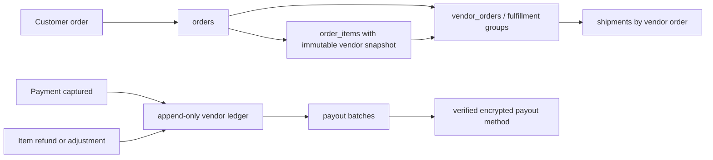

# Independent Commerce Multi-Vendor Architecture Program

**Updated:** 2026-07-14  
**Status:** Local marketplace implementation and canonical contract cleanup complete; release preparation and external review remain  
**Decision owner:** Product/platform owner  
**Repository:** independent project cloned from Scalius Commerce Lite

## Executive decision

Expand the existing Scalius Commerce codebase. Do not start a separate greenfield marketplace project.

The existing repository already has the expensive, reliability-sensitive parts of commerce: checkout coordination, payment idempotency, refunds, inventory reservations, order state transitions, delivery integrations, notifications, customer identity, RBAC, queues, cache invalidation, OpenAPI, and deployment tooling. Rebuilding those capabilities would create two platforms, duplicate operational risk, and delay the marketplace without solving the database-governance problem.

The approach is a **controlled in-place evolution with canonical authorities, feature flags, backfills, and reconciliation**. The owner confirmed that migrations `0058` and `0059` were never applied, so their old WIP design was replaced with the canonical local seller identity and order-allocation foundation.

The original public deployment is not a target environment. Active original domains and Cloudflare resource identities have been removed from runtime/deployment configuration, and remote mutations now fail closed.

## Immediate direction

1. Preserve the current canonical WIP on an owner-approved private remote snapshot before parallel staff work.
2. Keep marketplace public/write/financial feature flags disabled by default.
3. Enforce one public-sellable product predicate across all public reads and checkout.
4. Make order-item replacement/edit seller-allocation safe and atomic, or block unsupported edits.
5. Separate seller capabilities from platform-admin RBAC and add cross-seller negative tests.
6. Build the immutable seller ledger and item-allocated refunds before enabling financial dashboards, settlement, or payouts.
7. Provision independent Cloudflare staging/production resources only after local acceptance gates pass.

## Why expansion is the better option

| Criterion | Expand existing repository | New marketplace project |
|---|---|---|
| Checkout, payment, refund reliability | Reuse mature flows | Must rebuild or integrate remotely |
| Customer and order continuity | Native | Requires synchronization/migration |
| Operational complexity | One platform | Two deployables and two sources of truth |
| Time to marketplace MVP | Lower after canonical repair | Higher |
| Database-governance risk | Solved by program rules | Reappears in the new project without governance |
| Future maintenance | Shared domain model | Duplicated fixes and integrations |
| Recommended | **Yes** | No, unless the business model changes fundamentally |

A new project would be justified only if the product becomes a multi-tenant SaaS where every merchant receives an independent storefront, isolated database, independent payment account, independent checkout rules, and independent deployment lifecycle. That is not the architecture represented by the current repository or the requested marketplace model.

## Program documents

### Staff and owner entry points

- [`START-HERE-FOR-STAFF.md`](./START-HERE-FOR-STAFF.md) — the first and primary document for every staff member or implementation agent.
- [`OWNER-REVIEW-GUIDE.md`](./OWNER-REVIEW-GUIDE.md) — evidence-based review and release guide for the owner.
- [`STAFF-TASK-COMPLETION-TEMPLATE.md`](./STAFF-TASK-COMPLETION-TEMPLATE.md) — mandatory completion/handoff report for every staff task.

### Audits, progress, and architecture

- [`reports/2026-07-14-marketplace-implementation-progress.md`](./reports/2026-07-14-marketplace-implementation-progress.md) — current implementation evidence, fresh local D1 results, verification, limitations, and release blockers.
- [`reports/2026-07-13-local-foundation-progress.md`](./reports/2026-07-13-local-foundation-progress.md) — historical canonical-foundation evidence.
- [`../../superpowers/plans/2026-07-13-local-ownership-and-canonical-foundation.md`](../../superpowers/plans/2026-07-13-local-ownership-and-canonical-foundation.md) — completed local isolation and canonical foundation execution plan.
- [`2026-07-13-cloudflare-and-readiness-audit.md`](./2026-07-13-cloudflare-and-readiness-audit.md) — historical source-deployment audit retained to explain the isolation decision; superseded for current execution by the local progress report.
- [`2026-07-13-current-state-audit.md`](./2026-07-13-current-state-audit.md) — evidence-based audit of the current schema and write paths.
- [`2026-07-13-target-architecture.md`](./2026-07-13-target-architecture.md) — canonical marketplace domains, data model, invariants, and transaction boundaries.
- [`2026-07-13-migration-roadmap.md`](./2026-07-13-migration-roadmap.md) — phased rollout, backfill, feature flags, reconciliation, and rollback rules.
- [`DATABASE-GOVERNANCE.md`](./DATABASE-GOVERNANCE.md) — mandatory rules for database changes by humans and AI agents.
- [`MARKETPLACE-DATABASE-CONTRACT.md`](./MARKETPLACE-DATABASE-CONTRACT.md) — canonical authority matrix, compatibility boundaries, money/ownership rules, migrations, reconciliation, and generated API contract.
- [`SCHEMA-CHANGE-PROPOSAL-TEMPLATE.md`](./SCHEMA-CHANGE-PROPOSAL-TEMPLATE.md) — required proposal format before any new marketplace table or financial column.
- [`task-progress.yaml`](./task-progress.yaml) — shared task claims, blockers, release gates, and evidence status.
- [`../../superpowers/plans/2026-07-13-multivendor-marketplace-implementation.md`](../../superpowers/plans/2026-07-13-multivendor-marketplace-implementation.md) — task-by-task implementation master plan.

## Architecture summary

The target keeps the existing `orders` aggregate as the customer-facing purchase and introduces seller fulfillment partitions, immutable item ownership snapshots, versioned commission rules, item-level refund allocations, and an append-only seller ledger.

The existing single-store inventory becomes a platform-owned seller account during migration. This preserves current products and orders while making all future seller-scoped records explicit.

## Non-negotiable invariants

- A customer order may contain many vendors; each order item belongs to exactly one immutable vendor at purchase time.
- Public catalog reads return only approved products owned by approved vendors.
- Historical commercial records never lose vendor identity when a vendor or product is suspended or deleted.
- Financial amounts are stored as integer minor units; percentages are stored as integer basis points.
- Seller payable balance is derived from immutable ledger entries, not from mutable `vendor_orders` totals.
- Payments, refunds, commissions, holds, releases, adjustments, and payouts have unique idempotency keys.
- Seller-scoped services require an authenticated actor and explicit vendor scope at the domain boundary.
- Routes do not write marketplace tables directly.
- Applied migrations are immutable and forward-only.
- No agent may create a new table without a schema-change proposal and ownership review.

## Current release recommendation

Do not enable production marketplace capabilities yet. The local implementation now includes seller self-service, public eligibility, fulfillment, ledger, allocated refunds, settlement, and payout foundations, and the automated local gates are green. Production remains blocked by private source-control protection, browser end-to-end evidence, dedicated security and financial review, provider certification, and provisioning of a new independent environment through an approved release plan.
