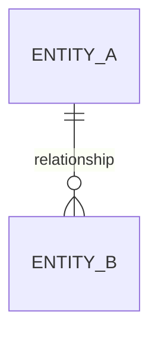

# Marketplace Schema-Change Proposal

Copy this file to `docs/architecture/multivendor/proposals/YYYY-MM-DD-<slug>.md` before implementing a new marketplace table, persistent JSON shape, financial column, status lifecycle, foreign key, unique constraint, delete rule, or source-of-truth change.

---

## Proposal metadata

- **Proposal ID:** `MV-SCHEMA-YYYY-NNN`
- **Title:**
- **Author/agent:**
- **Date:**
- **Status:** proposed | accepted | rejected | superseded
- **Task ID:**
- **Branch/worktree:**
- **Bounded context:**
- **Architecture owner:**
- **Schema integrator:**
- **Domain owner:**
- **Financial reviewer:** required | not required
- **Security reviewer:** required | not required
- **Target migration track:** A-unapplied-foundation | B-forward-correction
- **Reserved migration number:**

## 1. Problem statement

Describe the business fact or invariant that cannot be represented safely by the accepted architecture. State the user-visible or operational consequence of not changing the schema.

## 2. Existing authority and write paths

List every current table/column/service that stores or derives the fact.

| Fact | Existing authority/projection | Direct write paths | Read paths | Problem |
|---|---|---|---|---|
| | | | | |

Explain why extending an existing authority is or is not appropriate.

## 3. Proposed source of truth

Name exactly one canonical authority. Classify every other copy as one of:

- immutable snapshot
- cached projection
- audit event
- provider reference
- compatibility field scheduled for retirement

State how projections are rebuilt and reconciled.

## 4. Alternatives considered

At least three options are required unless the change is a simple constraint/index correction.

### Option A

- Shape:
- Benefits:
- Costs/risks:
- Migration impact:
- Decision:

### Option B

- Shape:
- Benefits:
- Costs/risks:
- Migration impact:
- Decision:

### Option C

- Shape:
- Benefits:
- Costs/risks:
- Migration impact:
- Decision:

## 5. Proposed relational model

### Tables/columns

| Table | Column | SQL type | Nullability/default | FK/delete behavior | Meaning |
|---|---|---|---|---|---|
| | | | | | |

### Keys and constraints

| Constraint/index | Columns | Business/query invariant |
|---|---|---|
| | | |

### Relationship diagram



## 6. Lifecycle and state machine

List every allowed status and transition. Include actor, reason, and timestamp requirements.

```text
state_a -> state_b | state_c
```

State how concurrent transitions are prevented or detected.

## 7. Money and accounting impact

Complete this section for any price, commission, payment, refund, settlement, adjustment, or payout change.

- Currency owner:
- Minor-unit exponent source:
- New `_minor` columns:
- New `_bps` columns:
- Allocation algorithm:
- Remainder rule:
- Journal event/account mapping:
- Reversal behavior:
- Idempotency key:
- Reconciliation equation:

No new marketplace REAL money/rate column is permitted.

## 8. Seller scope and authorization

- How is `vendor_id` obtained from trusted context?
- Which seller capability is required?
- Which platform permission is required?
- What prevents Seller A from reading/mutating Seller B data?
- What happens for suspended membership/vendor?
- What sensitive fields are masked/encrypted?
- Which negative tests are required?

## 9. Command and transaction boundary

Name the core command that owns the write. List every row written in the local D1 batch.

```ts
interface ProposedCommandInput {
  // complete accepted input contract
}
```

Describe:

- current-state load
- invariant checks
- CAS/version predicate
- idempotency claim
- D1 batch statements
- audit/outbox event
- returned result
- compensation strategy

If a provider/network call is involved, document claim/dispatch/finalize. Do not describe a transaction spanning the network call.

## 10. Migration plan

### Deployment evidence

Document whether migrations `0058` and `0059` were applied in each environment and the command/evidence used.

| Environment | 0058 | 0059 | Evidence/date |
|---|---|---|---|
| local | | | |
| preview/staging | | | |
| production | | | |

### Expand

List additive schema changes.

### Backfill

- Stable ordering key:
- Chunk size/limits:
- Checkpoint storage:
- Idempotency behavior:
- Concurrent write policy:
- Ambiguous row handling:
- Metrics/report:

### Dual write/compare

State legacy and canonical write paths, comparison job, and alert threshold. Financial comparison uses exact minor units.

### Cutover

List feature/read flags and the exact order in which they change.

### Contract/cleanup

List legacy columns/tables/writes to retire in a later migration.

## 11. Reconciliation

Provide executable equations/queries and expected zero-mismatch conditions.

```text
canonical_total = sum(canonical_components)
```

State where exceptions are stored and how they are reviewed.

## 12. Rollback and recovery

Rollback must preserve data. Document:

- feature flags to disable
- reads to switch back
- outbox events to retain/replay
- reservations/claims to release
- forward corrective migration strategy
- operations that must remain blocked

Do not propose editing an applied migration or deleting evidence rows as rollback.

## 13. Query and index plan

For every new index, provide the expected query shape.

| Query/use case | Filter/order columns | Proposed index | Expected cardinality |
|---|---|---|---|
| | | | |

## 14. Data classification and retention

| Field/table | Classification | Encryption/masking | Retention/deletion |
|---|---|---|---|
| | public/internal/PII/financial secret | | |

Confirm that logs, outbox payloads, metadata, and fixtures exclude secrets.

## 15. API and client impact

- OpenAPI request changes:
- OpenAPI response changes:
- API client regeneration:
- Backward compatibility:
- UI read/write flag:
- Export/report impact:

## 16. Test plan

List exact test files to create/modify and exact commands.

Required categories as applicable:

- migration from empty database
- migration from representative old snapshot
- backfill replay
- allowed and rejected state transitions
- cross-seller negative authorization
- integer allocation/remainder/property tests
- idempotent event replay
- journal balance/immutability/reversal
- refund/payout concurrency
- feature-flag rollback

## 17. Agent/file coordination

### Owned paths

- 

### Prohibited/high-contention paths

- 

### Required handoffs

- schema integrator:
- API contract owner:
- UI owner:
- reconciliation/release owner:

## 18. Acceptance checklist

- [ ] One canonical authority is named.
- [ ] Existing tables were evaluated before adding a new table.
- [ ] Bounded context and owner are clear.
- [ ] Money uses minor units/rates use basis points.
- [ ] Seller scope and negative tests are explicit.
- [ ] Delete behavior preserves historical/financial identity.
- [ ] Transaction/idempotency/outbox boundaries are complete.
- [ ] Migration history is verified.
- [ ] Backfill, reconciliation, and rollback are executable.
- [ ] Sensitive data is encrypted/masked.
- [ ] Query indexes have documented consumers.
- [ ] Domain, architecture, financial, and security approvals are recorded.

## 19. Decision record

- **Decision:**
- **Accepted option:**
- **Required changes before implementation:**
- **Approvers and dates:**
- **Supersedes:**
- **Superseded by:**
