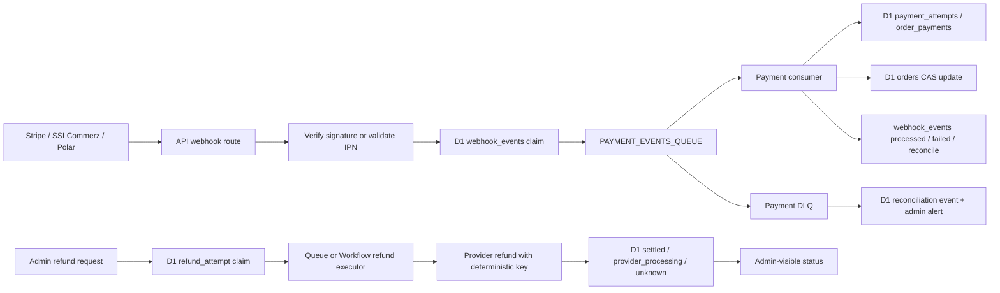

# Payment and Order Reliability on Cloudflare

Date: 2026-06-20

Scope: Stripe, SSLCommerz, Polar, payment webhooks, refunds, order creation, notifications, D1 idempotency, KV receipt proof, Queues, Durable Objects, Workflows, and service bindings in the current `scalius-commerce-lite` worktree.

This is research only. No code edits were made.

## Source rules

Platform claims below use current official Cloudflare documentation only:

- [Cloudflare Queues delivery guarantees](https://developers.cloudflare.com/queues/reference/delivery-guarantees/)
- [Cloudflare Queues batching, retries, delays](https://developers.cloudflare.com/queues/configuration/batching-retries/)
- [Cloudflare Queues dead letter queues](https://developers.cloudflare.com/queues/configuration/dead-letter-queues/)
- [Cloudflare Queues metrics](https://developers.cloudflare.com/queues/observability/metrics/)
- [Cloudflare D1 Worker API](https://developers.cloudflare.com/d1/worker-api/d1-database/)
- [Cloudflare D1 indexes](https://developers.cloudflare.com/d1/best-practices/use-indexes/)
- [Cloudflare Workers KV consistency model](https://developers.cloudflare.com/kv/concepts/how-kv-works/)
- [Cloudflare Durable Objects rules](https://developers.cloudflare.com/durable-objects/best-practices/rules-of-durable-objects/)
- [Cloudflare Durable Object SQLite storage](https://developers.cloudflare.com/durable-objects/api/sqlite-storage-api/)
- [Cloudflare Workflows overview](https://developers.cloudflare.com/workflows/get-started/guide/)
- [Cloudflare Workflows sleeping and retrying](https://developers.cloudflare.com/workflows/build/sleeping-and-retrying/)
- [Cloudflare Workflows rules](https://developers.cloudflare.com/workflows/build/rules-of-workflows/)
- [Cloudflare Workers service bindings](https://developers.cloudflare.com/workers/runtime-apis/bindings/service-bindings/)
- [Cloudflare Workers best practices](https://developers.cloudflare.com/workers/best-practices/workers-best-practices/)

## Executive conclusion

The current design is already much stronger than a naive webhook implementation. It uses D1 as the main state authority, Cloudflare Queues for asynchronous payment events and notifications, claim-before-side-effect webhook rows, unique gateway payment IDs, CAS-style order updates, fresh gateway settings for payment-sensitive paths, and a durable notification outbox with delivery receipts.

The main reliability gap is not "missing Queues"; it is incomplete end-to-end ownership of the split points between D1, Queues, and external payment providers. The highest-risk gaps are:

1. `webhook_events` are marked `queued`, but payment queue messages do not carry the webhook event ID, and the consumer never marks the webhook row `processed` or `failed`. If a message reaches a DLQ or is manually acked as non-retryable, future gateway retries can be skipped forever because the existing row is terminal from the webhook route's perspective.
2. Refunds make a local D1 claim before calling the provider, which is good, but on provider/network failure the code releases the claim and restores paid amount. If the provider accepted the refund but the response was lost, a retry can issue a second refund.
3. Payment session creation is not attempt-idempotent. Repeated Stripe/Polar/SSLCommerz session calls can create multiple payable attempts for one order/payment leg. Payment confirmation processing prevents double local crediting, but late successes can become manual reconciliation events.
4. KV is used as receipt-token proof for payment session creation and order receipt reads. KV is a good low-latency cache/status channel, but Cloudflare documents it as eventually consistent and not suitable for atomic read-write transactions. Receipt proof should have a D1 authority row, with KV as cache.
5. The current `POST /orders` path in this worktree commits synchronously with `commitStorefrontOrderPayload()` and uses `waitUntil()` only for post-commit side effects, while `ORDER_INGEST_QUEUE` remains configured and older docs still describe queued ingest. This is a product decision point: synchronous commit is simpler and gives immediate order proof, but it moves D1/inventory latency back onto checkout.

The most robust incremental path is to copy the notification outbox pattern into payment webhooks/refunds: D1-owned attempts and events first, Queue or Workflow execution second, provider idempotency/probe keys third, and DLQ/reconciliation state visible to admins.

## Cloudflare platform facts that matter

### Queues

Cloudflare Queues are at-least-once by default. Messages can be delivered more than once, so all consumers must be idempotent. Cloudflare's own guidance is to generate unique IDs and use database primary keys or upstream idempotency keys to dedupe effects.

Queue batches can be acknowledged per message with `ack()` and retried with `retry()`, which is important for mixed batches containing independent payment events. If one message fails and individual acking is not used, an entire batch can be retried. The default retry behavior is three attempts unless configured otherwise, and messages that reach `max_retries` are deleted or moved to a configured dead letter queue. Delays and retry delays can be used for backpressure.

Queues expose backlog, consumer concurrency, and message operation metrics. These should become reliability SLO inputs for payment-events, order-notifications, and any future refund queue.

### D1

D1 uses SQLite semantics through the Worker binding. `batch()` sends multiple SQL statements in one call, and Cloudflare documents batched statements as SQL transactions: if one statement fails, the sequence is aborted or rolled back. This makes D1 a good source of truth for payment claims, idempotency rows, outbox rows, and receipt proofs.

D1 indexes are useful both for performance and uniqueness constraints. This repo correctly relies on unique partial indexes for gateway payment idempotency where Drizzle cannot express the index directly.

### KV

Cloudflare KV is optimized for global low-latency reads and high read volume. Cloudflare documents that KV writes go to central stores and are cached in Cloudflare locations after reads; KV is eventually consistent and not ideal for atomic operations or read-write transactions. KV should not be the only authority for receipt proof, payment attempt proof, or "exactly once" state.

### Durable Objects

Durable Objects are single-threaded, globally unique instances with persistent storage. SQLite-backed Durable Object storage is transactional and strongly consistent, private to the object instance. This is useful for per-entity coordination, such as serializing all commands for a single order or refund attempt.

The docs also warn against a single global Durable Object because it becomes a bottleneck. If used here, the object ID should be deterministic per order, per checkout, or per refund attempt, not one global payment object.

### Workflows

Cloudflare Workflows provide durable multi-step execution that can retry, persist state, run for hours or days, sleep, and coordinate between third-party APIs. Workflow steps can have retry policies and sleeps. Cloudflare also warns that API and binding calls in Workflow steps should be idempotent because steps may retry.

Workflows are relevant for long-running provider reconciliation, especially refunds and SSLCommerz refund-status polling. They are probably unnecessary for the hot webhook path, where Queues plus D1 idempotency are enough.

### Service bindings and `waitUntil`

Service bindings let one Worker call another without a public URL. This repo already uses admin and storefront bindings to the API Worker in production.

`ctx.waitUntil()` is appropriate for non-critical post-response work. Cloudflare best practices say to await work that the response depends on, and use `waitUntil()` only for work that can happen after the response and fit within the waitUntil time limit. The current order route follows that principle for post-commit side effects.

## Current repo map

### Payment/session creation

- Stripe: `apps/api/src/routes/payment/stripe-routes.ts`
  - Requires `receiptToken`, validates order payability, fresh-reads checkout allowlist/settings, creates a PaymentIntent, then stores `orders.paymentIntentId`.
- SSLCommerz: `apps/api/src/routes/payment/sslcommerz-routes.ts`
  - Requires `receiptToken`, derives trusted callback URLs from runtime config/request origin, creates a unique `tran_id`, stores the session key.
- Polar: `apps/api/src/routes/payment/polar-routes.ts`
  - Requires `receiptToken`, converts unsupported store currencies to USD when needed, stores original local amount in metadata for later local-currency payment recording.

Observation: these calls are protected, but not idempotent at the "attempt" level. Repeated browser retries can create multiple provider-side attempts.

### Webhook ingestion

- Stripe webhook: `apps/api/src/routes/webhooks/stripe.ts`
  - Fresh-reads settings, verifies signature, builds `eventId`, claims `webhook_events`, sends a message to `PAYMENT_EVENTS_QUEUE`, marks event `queued`.
- SSLCommerz webhook: `apps/api/src/routes/webhooks/sslcommerz.ts`
  - Fresh-reads settings, validates IPN by provider API call before trusting payload, derives canonical order/payment type from validated data plus server state, claims `webhook_events`, sends a queue message.
- Polar webhook: `apps/api/src/routes/webhooks/polar.ts`
  - Fresh-reads settings, verifies standard webhook signature, builds a source ID including refund details where needed, claims `webhook_events`, sends a queue message.
- Shared idempotency: `apps/api/src/utils/webhook-idempotency.ts`
  - Insert-first claim. Reclaims `failed` rows and stale `processing` rows. Does not reclaim `queued` rows.

### Queue consumer

- `apps/api/src/queue-consumer.ts`
  - Handles `payment-events`, `order-notifications`, `auth-otp`, and legacy/configured `order-ingest`.
  - For normal payment/notification/OTP batches, it uses `Promise.allSettled`, then per-message `ack()` on success and `retry({ delaySeconds: 30 })` on failure.
  - Payment confirmation calls `processPaymentConfirmed()`.
  - Non-retryable payment confirmation outcomes log manual reconciliation and return success to the queue handler, so the message is acked.

### Payment confirmation

- `packages/core/src/modules/payments/process-payment.ts`
  - Uses gateway IDs as local idempotency keys.
  - Creates or resumes a pending `order_payments` claim.
  - Updates order totals/status with version checks and payable-state guards.
  - Unique partial indexes are declared in migrations for Stripe PaymentIntent, Polar checkout, and SSLCommerz `val_id`.

### Refunds

- API route: `apps/api/src/routes/admin/orders-refund.ts`
- Orchestrator: `packages/core/src/modules/payments/refund-service.ts`
- Providers:
  - Stripe refund wrapper calls `stripe.refunds.create({ charge, amount, reason })`.
  - SSLCommerz refund wrapper generates `refundTranId` from `Date.now()`.
  - Polar refund wrapper calls `client.refunds.create({ orderId, amount, reason, comment })`.

The orchestrator locally claims refund capacity using deterministic `refund_${orderId}_${order.version}`, updates paid amount/status, then calls the provider. On provider error it marks the refund payment failed and restores the order's previous paid amount/status.

This blocks concurrent admin refunds, but it does not safely handle ambiguous provider outcomes.

### Order creation and receipt proof

- Current `POST /orders`: `apps/api/src/routes/orders.ts`
  - Generates `checkoutToken`, writes `checkout_status:{token}` and `order_receipt:{token}` to KV, then synchronously calls `commitStorefrontOrderPayload()`.
  - After commit, it uses `waitUntil()` for `runStorefrontOrderPostCommitSideEffects()`.
- Receipt token validation: `apps/api/src/utils/order-receipt-token.ts`
  - Reads `order_receipt:{token}` from KV and checks `orderId`.
- Synchronous commit: `packages/core/src/modules/orders/orders.ingest.ts`
  - Commits customers, order, items, discount usage, inventory reservation, and notification outbox in D1.

This worktree still has `ORDER_INGEST_QUEUE` configured in `apps/api/wrangler.jsonc`, and `packages/core/src/modules/orders/orders.queue.ts` still implements a queued ingest path, but the current API route is not using that queue.

### Notifications

- Outbox: `packages/core/src/modules/notifications/order-notification-outbox.ts`
- Delivery receipts: `packages/core/src/modules/notifications/order-notification-delivery-receipts.ts`
- Cron flush: `apps/api/src/worker.ts`

This is the strongest reliability pattern in the repo: D1 outbox row, deterministic dedupe key, claim leases, Queue dispatch, channel receipt rows, retry delays, and cron flush for pending/failed/stale rows. Payment/refund paths should move closer to this model.

## Bottlenecks

### 1. Checkout now waits on D1 commit and inventory

The current order route writes KV status/receipt proof, then awaits `commitStorefrontOrderPayload()`. That path checks customer, discount limits, reserves stock, and writes order data. This is simpler than queued ingest, but checkout latency now includes D1/inventory contention.

Recommendation: choose one model deliberately:

- Keep synchronous order commit if immediate order proof is worth the latency. Then remove or demote stale `ORDER_INGEST_QUEUE` docs/config to avoid operational confusion.
- Or restore queued ingest, but first create a D1 `checkout_intents` or `order_receipts` row synchronously so receipt proof/status are not KV-only.

### 2. Payment events rely on queue success without durable post-consume state

Webhook routes claim a D1 event and mark it `queued` after `queue.send()`. The consumer message does not include `webhookEventId`, so the consumer cannot mark `webhook_events` as `processed`, `failed`, `manual_reconciliation`, or `dlq`.

This makes `queued` a blind terminal state. It is enough to dedupe duplicate provider webhooks, but not enough to know whether the queue side effect actually reached D1 order state.

### 3. Refunds block admin requests on provider latency

Refunds are synchronous request/response operations. The admin waits for the gateway call, and ambiguous network/provider failures are collapsed into local rollback. Refunds are the best fit in this codebase for an outbox or Workflow migration.

### 4. Queue DLQs exist but need first-class operations

`apps/api/wrangler.jsonc` configures DLQs for payment-events, order-notifications, auth-otp, and order-ingest. I did not find a DLQ consumer or admin/cron reconciliation path. Without that, a DLQ is only a holding area, not a recovery mechanism.

### 5. KV receipt proof can be an availability bottleneck

If KV is delayed, unavailable, or a receipt key expires while the order still exists, payment-session creation and receipt lookup fail. That is safe in the sense that it fails closed, but it creates unnecessary payment/order support cases.

## Correctness risks

### P0/P1: Webhook `queued` rows can suppress recovery

Flow:

1. Webhook verifies provider payload.
2. `claimWebhookEvent()` inserts event as `processing`.
3. `queue.send()` succeeds.
4. Webhook route marks event `queued`.
5. Queue consumer fails enough times to hit DLQ, or a non-retryable branch logs manual reconciliation and acks.
6. Provider retries the webhook.
7. The route sees existing `queued` and skips.

The provider retry no longer repairs the failed internal side effect. This is the most important webhook gap.

Incremental fix:

- Add `webhookEventId` and source provider event ID to every `PaymentQueueMessage`.
- On successful payment consumer processing, mark `webhook_events.status = processed`.
- On retryable consumer failure that will be retried by Queue, leave status `queued` or `processing` with a heartbeat.
- On non-retryable payment outcome, mark `manual_reconciliation` or `processed_nonpayable`, not just log.
- Add a scheduled stale-queued scanner: rows `queued` for more than N minutes with no matching succeeded/failed payment record become `failed` or `needs_reconciliation`.
- Add a DLQ consumer that marks the source event `failed` and creates an admin-visible reconciliation row.

### P0/P1: Refund ambiguous outcome can double-refund

The local refund claim is good. The unsafe part is releasing the claim and restoring paid amount when the provider call throws. A thrown error can mean "provider rejected it" or "provider accepted it and the response was lost."

Examples from code:

- Stripe refund wrapper does not pass an idempotency key in the shown call.
- SSLCommerz refund uses a timestamp-derived `refundTranId`, not the D1 refund claim ID.
- Polar refund calls provider create directly with no local attempt key visible in the request.

Incremental fix:

- Add `refund_attempts` or expand `order_payments` refund metadata into first-class columns: `attempt_id`, `provider_refund_id`, `provider_idempotency_key`, `status`, `unknown_outcome_at`, `next_probe_at`, `last_error`.
- Use the D1 refund attempt ID as every provider idempotency/reference key where the provider supports one; for SSLCommerz use it as `refund_trans_id`.
- Never restore local paid amount for an ambiguous timeout/network error. Move the attempt to `unknown` or `reconciling`; block duplicate refunds for that amount/order until probed.
- Probe provider refund status on a Queue/Workflow retry. Only restore local state after a confirmed provider rejection.
- Surface `unknown` and `provider_processing` states in admin.

### P1: Payment session creation creates multiple payable attempts

Repeated client retries create new provider sessions/intents. The local confirmation path protects local money movement with unique gateway IDs and payable-state checks, but multiple provider attempts can still succeed. Late extra successes become non-payable manual reconciliation events rather than normal state.

Incremental fix:

- Add `payment_attempts` with a deterministic key like `{orderId}:{paymentType}:{amount}:{gateway}:{orderVersion/settingsVersion}`.
- Session routes first create or reuse an active attempt row.
- Provider metadata includes `attemptId`.
- Webhooks map provider event -> attempt -> order.
- If a new attempt replaces an old attempt, record the old attempt as superseded and try to cancel where safe.

### P1: KV receipt token is proof, but KV is not an authority store

Current `validateReceiptToken()` uses KV only. Cloudflare documents KV as eventually consistent and unsuitable for atomic transactions.

Incremental fix:

- Add D1 `order_receipts` or `checkout_intents`: `token_hash`, `order_id`, `created_at`, `expires_at`, `used_for_payment_at`, `status`.
- Store only token hash in D1.
- Continue writing KV `order_receipt:{token}` as a cache for fast reads.
- Validation path: KV hit is fast path, D1 is authoritative fallback.
- On order commit failure, mark D1 intent failed; do not leave a valid receipt proof without an order.

### P1/P2: Non-retryable payment successes need durable reconciliation, not only logs

`assertPaymentConfirmed()` treats `retryable === false` as manual reconciliation and returns, so the queue message is acked. That is appropriate for non-payable late successes, but the outcome should become queryable state.

Incremental fix:

- Add `payment_reconciliation_events` or a `webhook_events.status = manual_reconciliation`.
- Store provider, gateway event ID, order ID, amount, reason, and raw normalized provider references.
- Build an admin queue for "external money moved but local order not mutated."

### P2: Workflows/DO should be introduced narrowly

Do not move all payment processing into a single Durable Object or all webhooks into Workflows. That would add bottlenecks and operational complexity.

Useful places:

- Workflows: refund dispatch, provider polling, delayed reconciliation, long-running payment-attempt expiry/cancel workflows.
- Durable Objects: optional per-order command coordinator if D1 CAS conflicts become frequent, or per-payment-attempt locking if gateway sessions are hammered.
- Queues: keep high-volume webhook ingestion and notification fanout.

## Proposed target architecture

## Incremental migration steps

### Step 1: Observability before behavior changes

- Add dashboard/admin queries for:
  - `webhook_events` stuck in `processing` beyond the lease.
  - `webhook_events` stuck in `queued` beyond expected queue latency.
  - payment queue DLQ depth.
  - pending/unknown refund attempts.
  - payment confirmations that returned `retryable: false`.
- Alert on Cloudflare Queue backlog and DLQ metrics for payment-events and order-notifications.

### Step 2: Close the webhook -> queue -> D1 loop

- Add `webhookEventId` to all payment queue messages.
- Mark webhook rows processed when the queue consumer commits the payment effect or records an intentional no-op.
- Mark non-retryable outcomes as `manual_reconciliation`.
- Add a cron sweeper for stale queued rows.
- Add a DLQ consumer or manual command that moves source webhook rows to failed/reconciliation.

### Step 3: Move receipt proof from KV-only to D1-authoritative

- Create D1 receipt/checkout intent rows on order creation.
- Store token hashes, not raw tokens.
- Keep KV for checkout polling and fast receipt validation.
- Make payment-session routes fall back to D1 when KV misses.

### Step 4: Add payment attempts

- Create a D1 `payment_attempts` table or equivalent columns.
- Make session creation idempotent per order/payment leg.
- Include attempt IDs in provider metadata and webhook queue messages.
- Store provider attempt IDs separately from `orders.paymentIntentId`, which should not be the only latest pointer.

### Step 5: Make refunds durable

- Create D1 refund attempt before provider calls.
- Execute refund dispatch through Queue or Workflows.
- Use deterministic provider keys derived from the local attempt ID.
- Treat network timeouts as unknown/provider-processing, not local rollback.
- Add provider-status polling and admin-visible reconciliation.

### Step 6: Decide the order ingest model

- If synchronous commit is the intended model, remove old queued-ingest documentation and consider removing unused producer config after verifying no other caller sends to `ORDER_INGEST_QUEUE`.
- If queued ingest is preferred, make D1 checkout intents authoritative and make the browser poll D1-derived status rather than KV-only status.

## Best near-term wins

1. Carry `webhookEventId` through `PAYMENT_EVENTS_QUEUE` and mark terminal webhook outcomes in D1.
2. Add a payment DLQ recovery path.
3. Stop treating ambiguous refund provider errors as local provider rejection.
4. Add D1 receipt proof with KV as cache.
5. Add admin-visible reconciliation rows for late/non-payable successful gateway events.

These changes are incremental, align with existing repo patterns, and use Cloudflare-native primitives without over-rotating into a global Durable Object or Workflow-only payment system.
